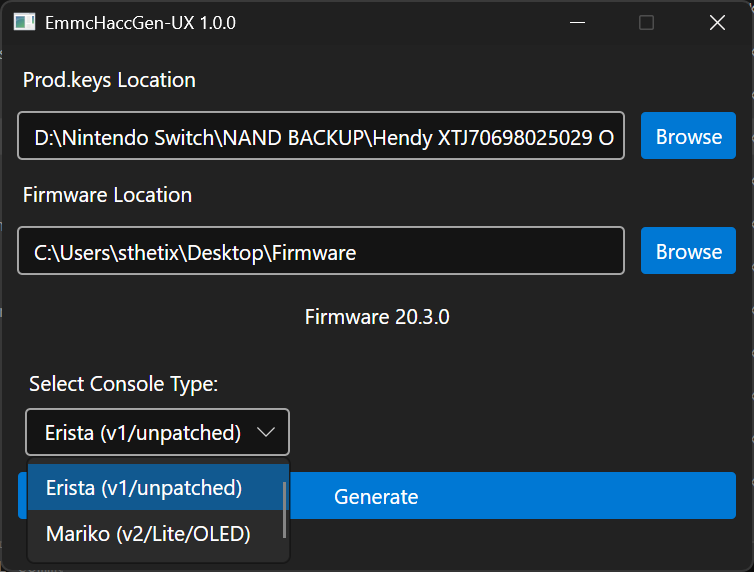

# EmmcHaccGen-UX

A revised and simplified version of EmmcHaccGen, designed for a more user-friendly experience.

## Description

This project is a modified version of the original EmmcHaccGen GUI. The goal is to provide a cleaner and more intuitive user experience by simplifying the interface and removing options that can cause user confusion.

Key changes include:
- **Simplified GUI:** Replaces the Erista/Mariko toggle with a clear dropdown menu.
- **AutoRCM Removed:** The option to enable AutoRCM has been removed to prevent user confusion, as it can sometimes lead people to believe their console is bricked.
- **Default ExFAT Support:** ExFAT support is now automatically enabled for all generated firmware, removing an unnecessary manual step and ensuring broad compatibility.
- **Modern Foundation:** The project has been updated to a newer, supported .NET framework for better security and performance.

## How to use

1. Go to the [Releases](https://github.com/sthetix/EmmcHaccGen-UX/releases) tab and download the latest release.
2. Extract the contents into a new folder.
3. Open `EmmcHaccGen.GUI.exe`.
4. Select the location of your `prod.keys` file and the firmware folder.
5. Choose your console type (Erista or Mariko) from the dropdown menu, then click "Generate".

## Credits

- **Denn/Dennthecafebabe:** For being awesome in general and for their work on Vaporware and Pyhac.
- **Thealexbarney:** For making libhac, which is used in this project.
- **suchmememanyskill:** For the original EmmcHaccGen project, which this is based on.
